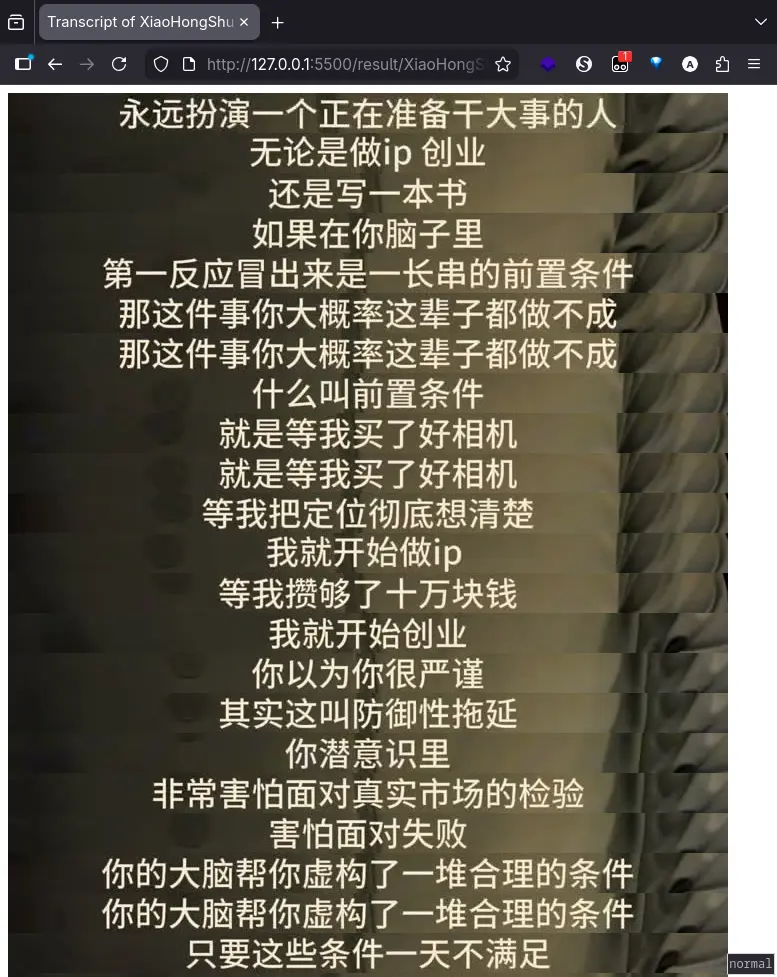

# Transcript

A Node.js tool for downloading videos and generating transcripts with snapshots.



## How it works

1. **Download Video**: Downloads videos using `yt-dlp` from a video URL
2. **Extract Snapshot**: Takes snapshots from the video using `ffmpeg`
3. **Auto-detect Caption Region**: Analyzes brightness gradients across averaged frames to detect the caption region—no manual position configuration needed
4. **Generate Transcript**: Creates an HTML transcript with cropped snapshot frames embedded

## Usage

```bash
# Install dependencies
pnpm install

# Run (edit the URL in src/index.ts, then:)
npx ts-node src/index.ts
```

**Input**: Video URL (e.g. XiaoHongShu, YouTube). Edit the URL in `src/index.ts` before running.

## Example Output

The script will:

- Download the video to `res/downloads/` directory
- Create snapshots in `res/snapshots/` directory
- Auto-detect the caption region and save averaged frames to `res/average/` directory
- Crop transcript regions to `res/cropped/` directory (using the auto-detected caption position)
- Generate an HTML transcript file in `res/result/` directory

## Supported Platforms

Supports 1800+ platforms including YouTube, TikTok, Instagram, Bilibili, XiaoHongShu, and many more. See [yt-dlp supported sites](https://github.com/yt-dlp/yt-dlp/blob/master/supportedsites.md) for the full list.

## System Dependencies

- `yt-dlp` - for video downloading
- `ffmpeg` - for video processing and snapshots
- `ffprobe` - for video metadata extraction
